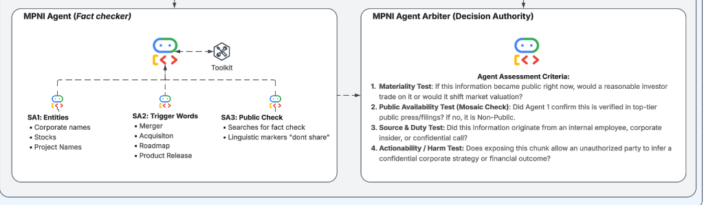

# Material Non-Public Information (MNPI) Compliance Agent System

Built with the **Google Agent Development Kit (Google ADK)**.



This system implements a two-agent architecture for automated compliance evaluation of communications, research notes, call transcripts, and corporate documents against federal securities laws and institutional compliance standards.

---

## 📐 Architecture Overview

```
                                  [ Input Text Chunk ]
                                            │
                                            ▼
┌────────────────────────────────────────────────────────────────────────────────────────┐
│                        MPNI Agent (Fact checker Coordinator)                           │
│                                                                                        │
│                                      [🤖 LLM]                                          │
│                                         ▲                                              │
│                   ┌─────────────────────┼─────────────────────┐                        │
│                   ▼ (Tool)              ▼ (Tool)              ▼ (Tool)                 │
│             ┌───────────┐         ┌───────────┐         ┌───────────┐                  │
│             │    SA1    │         │    SA2    │         │    SA3    │                  │
│             │  Entities │         │  Triggers │         │Public Chk │                  │
│             └─────┬─────┘         └─────┬─────┘         └─────┬─────┘                  │
│                   │                     │                     │                        │
│         • Corporate names        • Merger              • Fact-check search             │
│         • Stocks / Tickers       • Acquisition         • Secrecy markers:              │
│         • Project Codenames      • Roadmap / Release     "don't share", "confidential" │
└─────────────────────────────────────────┼──────────────────────────────────────────────┘
                                          │
                                          ▼ FactCheckingDossier
┌────────────────────────────────────────────────────────────────────────────────────────┐
│                        MPNI Agent Arbiter (Decision Authority)                         │
│                                                                                        │
│                                      [🤖 LLM]                                          │
│                                                                                        │
│   Instructional Legal & Compliance Evaluation Criteria:                                │
│   1. Materiality Test:                                                                 │
│      Would a reasonable investor trade on it or would it shift market valuation?      │
│   2. Public Availability Test (Mosaic Check):                                          │
│      Did Agent 1 confirm this is verified in top-tier public press/filings?            │
│   3. Source & Duty Test:                                                               │
│      Did this originate from internal employee, insider, or confidential call?         │
│   4. Actionability / Harm Test:                                                        │
│      Does exposing this allow inferring confidential corporate strategy/financials?    │
│                                                                                        │
│   Output: ArbiterVerdict (MNPI_CONFIRMED | POTENTIAL_MNPI | PUBLIC_NON_MATERIAL)       │
└────────────────────────────────────────────────────────────────────────────────────────┘
```

---

## 🔑 Key Google ADK Concepts Used

1. **Sub-Agents as Tools (`mode='single_turn'`)**:
   In Google ADK, setting `mode='single_turn'` on a sub-agent and attaching it to a parent `Agent(sub_agents=[sa1, sa2, sa3])` automatically exposes the sub-agents as callable tools to the parent LLM. The Fact Checker coordinates SA1, SA2, and SA3 as specialized tools to assemble an objective factual dossier.

2. **Instructional Arbiter Persona**:
   The Arbiter agent uses an instructional, jurisprudential system prompt encoding the SEC / federal securities legal standards (*Basic Inc. v. Levinson*, *TSC Industries v. Northway*, *Dirks v. SEC*, *Mosaic Theory*).

3. **Google ADK `Workflow` & `Runner`**:
   The agents are chained into a directed workflow graph:
   ```python
   Workflow(
       name="mnpi_compliance_workflow",
       edges=[
           ("START", fact_checker_agent),
           (fact_checker_agent, arbiter_agent),
       ]
   )
   ```
   Orchestrated with `Runner(session_service=InMemorySessionService())`.

---

## 📁 Project Structure

```
mnpi_adk_agent/
├── config.py                 # Central configuration, models, trigger dictionaries, codenames
├── schemas.py                # Pydantic models (SA1, SA2, SA3 outputs, Dossier, ArbiterVerdict)
├── fact_checker_agent.py     # Agent 1: Coordinates SA1, SA2, SA3 sub-agents as tools
├── arbiter_agent.py          # Agent 2: Decision Authority applying the 4 Assessment Tests
├── workflow.py               # Native ADK Workflow, Runner, and offline deterministic executor
├── main.py                   # Interactive CLI and scenario runner
├── test_suite.py             # Unit and integration test suite
├── .env.example              # Environment variables template
├── sub_agents/
│   ├── __init__.py
│   ├── entities_agent.py     # SA1: Corporate names, tickers, project codenames
│   ├── trigger_words_agent.py# SA2: M&A, roadmap, product release, financial triggers
│   └── public_check_agent.py # SA3: Press/SEC fact-check, linguistic secrecy markers
└── tools/
    ├── __init__.py
    ├── entity_tools.py       # Ticker resolution & confidential codename registry
    └── search_tools.py       # SEC/Wire search & secrecy phrase detection
```

---

## 🚀 Quickstart & Testing

### 1. Run the Test Suite (Offline / Zero-Dependency)
The system includes deterministic compliance rules so you can test immediately without external API credentials:
```bash
python3 test_suite.py
```
Output:
```
test_adk_workflow_graph_structure ... ok
test_benign_routine_memo ... ok
test_confirmed_public_news ... ok
test_critical_mnpi_leak ... ok
test_unannounced_roadmap_slip ... ok

----------------------------------------------------------------------
Ran 5 tests in 0.010s

OK
```

### 2. Run Built-In Compliance Scenarios via CLI
```bash
# Critical MNPI leak scenario:
python3 main.py --scenario leak

# Verified public news scenario:
python3 main.py --scenario public

# Unannounced roadmap delay scenario:
python3 main.py --scenario roadmap

# Benign internal memo scenario:
python3 main.py --scenario benign
```

### 3. Test Custom Text
```bash
python3 main.py --text "Project Titan is acquiring TechCo next week. Don't share."
```

### 4. Interactive Mode
```bash
python3 main.py --interactive
```

---

## 🛠️ Where to Fill in Further Context & Details

This template is designed to be easily customized with your organization's specific data sources:

| Component | File to Modify | Context / Integration to Add |
| :--- | :--- | :--- |
| **Internal Project Codenames** | `config.py` (`known_project_codenames`) | Add your enterprise's internal confidential code names (e.g. `Project Horizon`, `Project Apollo`). |
| **Corporate Watchlists / Tickers** | `tools/entity_tools.py` (`TICKER_DIRECTORY`) | Connect to your corporate database, Thomson Reuters/FactSet/Refinitiv symbology, or Bloomberg FIGI API. |
| **M&A / Corporate Triggers** | `config.py` (`ma_triggers`, `financial_triggers`) | Add domain-specific terms relevant to your business unit (e.g. biotech clinical trials, oil discoveries, semiconductor yield slips). |
| **Public Verification Engine** | `tools/search_tools.py` (`search_public_press_and_filings`) | Connect to real-time search APIs: Google Search Tool (`google.adk.tools.google_search_tool`), SEC EDGAR Full-Text Search API, or Dow Jones Newswires. |
| **Arbiter Risk Thresholds** | `workflow.py` (`run_offline_arbiter`) & `arbiter_agent.py` | Adjust the score thresholds (e.g. materiality cutoff, escalation rules) to match your firm's compliance risk tolerance. |

---

## ⚖️ The 4 Arbiter Assessment Criteria

1. **Materiality Test**:
   - *Question*: If this information became public right now, would a reasonable investor trade on it or would it shift market valuation?
   - *Legal Standard*: *TSC Industries v. Northway* / *Basic Inc. v. Levinson*.

2. **Public Availability Test (Mosaic Check)**:
   - *Question*: Did Agent 1 confirm this is verified in top-tier public press/filings? If no, it is Non-Public.
   - *Legal Standard*: Mosaic Theory (*Dirks v. SEC*).

3. **Source & Duty Test**:
   - *Question*: Did this information originate from an internal employee, corporate insider, or confidential call?
   - *Legal Standard*: *Chiarella v. United States* / *Dirks v. SEC* (Duty of trust and confidentiality).

4. **Actionability / Harm Test**:
   - *Question*: Does exposing this chunk allow an unauthorized party to infer a confidential corporate strategy or financial outcome?
   - *Legal Standard*: Misappropriation theory and competitive harm.

---

## ☁️ Deployment to Vertex AI Agent Runtime

This project is configured for automated deployment to **Vertex AI Agent Runtime** (Agent Engine / Reasoning Engine) using Google ADK and GitHub Actions:

- **Target Google Cloud Project**: `green-carrier-500109-k2`
- **Project Number**: `799321431260`
- **Region**: `us-central1` (configurable)
- **Workflow**: `.github/workflows/deploy.yml`

### 1. Manual / Local Deployment via ADK CLI
```bash
adk deploy agent_engine . \
  --project=green-carrier-500109-k2 \
  --region=us-central1 \
  --display_name="mnpi-compliance-agent" \
  --otel_to_cloud
```

### 2. CI/CD via GitHub Actions (Workload Identity Federation)
The GitHub Actions workflow uses keyless **Workload Identity Federation (WIF)** to authenticate directly to Google Cloud without storing long-lived service account JSON keys.

To set up Workload Identity Federation in GCP:
```bash
# 1. Create a Workload Identity Pool
gcloud iam workload-identity-pools create "github-actions-pool" \
  --project="green-carrier-500109-k2" \
  --location="global" \
  --display-name="GitHub Actions Pool"

# 2. Create the GitHub OIDC Provider in the pool
gcloud iam workload-identity-pools providers create-oidc "github-actions-provider" \
  --project="green-carrier-500109-k2" \
  --location="global" \
  --workload-identity-pool="github-actions-pool" \
  --display-name="GitHub Actions Provider" \
  --issuer-uri="https://token.actions.githubusercontent.com" \
  --attribute-mapping="google.subject=assertion.sub,attribute.actor=assertion.actor,attribute.repository=assertion.repository"

# 3. Create a dedicated deployer Service Account
gcloud iam service-accounts create "github-actions-deployer" \
  --project="green-carrier-500109-k2" \
  --display-name="GitHub Actions Deployer"

# 4. Grant required IAM roles to the Service Account
for ROLE in roles/aiplatform.admin roles/storage.admin roles/artifactregistry.admin roles/cloudbuild.builds.editor roles/iam.serviceAccountUser; do
  gcloud projects add-iam-policy-binding "green-carrier-500109-k2" \
    --member="serviceAccount:github-actions-deployer@green-carrier-500109-k2.iam.gserviceaccount.com" \
    --role="${ROLE}"
done

# 5. Allow GitHub Actions to impersonate the Service Account
gcloud iam service-accounts add-iam-policy-binding "github-actions-deployer@green-carrier-500109-k2.iam.gserviceaccount.com" \
  --project="green-carrier-500109-k2" \
  --role="roles/iam.workloadIdentityUser" \
  --member="principalSet://iam.googleapis.com/projects/799321431260/locations/global/workloadIdentityPools/github-actions-pool/attribute.repository/bschmult-g/MNPI-pipeline"
```

Once configured, any push to `main` (or manual dispatch via the Actions tab) will run the test suite and deploy the latest agent code to Vertex AI Agent Runtime.
