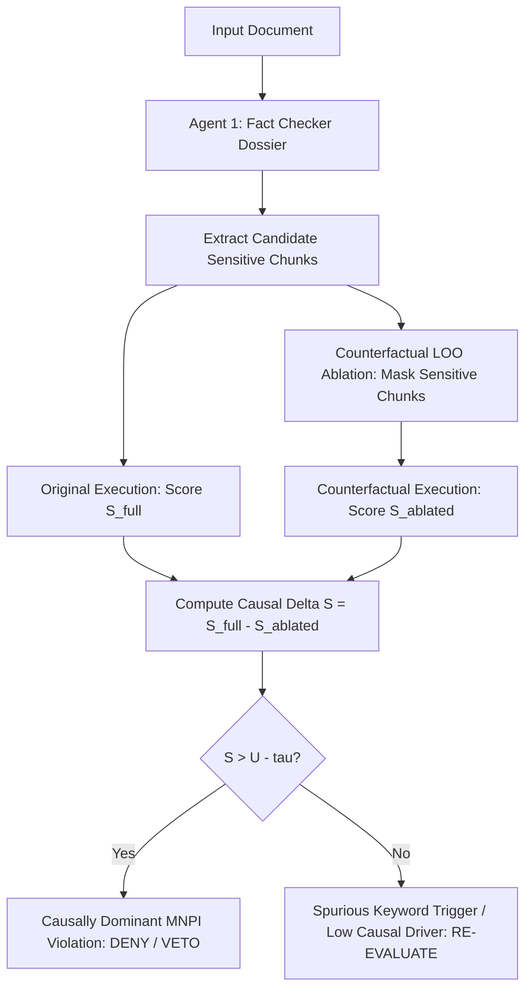

# Implementation Plan: Reinforcement Learning & Causal Attribution (LOO) for MNPI Arbiter

## Goal Description
Implement a machine-enforceable verification and reinforcement learning ("Trial-without-Error") feedback framework for the **MNPI Decision Authority Arbiter**.

This enhancement upgrades the Arbiter across three core mathematical and architectural pillars:
1. **Standardized Justification & Verification Codes**: Replace purely unstructured text rationales with machine-enforceable categorical codes mapping directly to the 4 legal assessment tests (Materiality, Mosaic Check, Source & Duty, Actionability/Harm).
2. **Causal Attribution Scoring via Leave-One-Out (LOO) Counterfactual Ablation**: Implement counterfactual sensitivity analysis to prove whether identified sensitive tokens are the true causal driver of the compliance violation, eliminating keyword false positives.
3. **Reinforcement Learning ("Trial-without-Error") Offline Feedback Loop**: Implement a reward-shaping engine and DPO (Direct Preference Optimization) dataset synthesizer that penalizes non-compliant agent trajectories without risking live real-world breaches.

---

## User Review Required

> [!IMPORTANT]
> **Zero Breaking Changes to Existing Pipeline**:
> All proposed changes maintain strict backward compatibility. Existing CLI runners (`python main.py`), the demo server (`python demo_server.py`), and test suites will continue to run seamlessly. The new verification codes, causal ablation metrics, and RL reward scores will enrich the existing `ArbiterVerdict` schema.

> [!NOTE]
> **Branch Isolation**:
> All implementations will be built and tested strictly on the **`dev-features`** branch. Production Vertex AI Reasoning Engine instances remain protected.

---

## Architecture & Mathematical Foundations

### 1. The 4 Standardized Verification & Justification Codes

Instead of relying solely on narrative prose, each of the 4 Arbiter assessment tests will output a standardized, machine-parsable categorical code:

| Test | Standardized Codes | Machine Interpretation & Threshold |
| :--- | :--- | :--- |
| **1. Materiality** | `MAT_01_MARKET_MOVING_MA`<br>`MAT_02_EARNINGS_VARIANCE`<br>`MAT_03_ROADMAP_DISRUPTION`<br>`MAT_04_REGULATORY_RESTRICTION`<br>`MAT_CLEARED_DE_MINIMIS` | Material corporate transaction, revenue surprise, or key milestone.<br>Threshold: $\text{Score} \ge 0.70$ |
| **2. Mosaic Check** | `MOSAIC_01_VERIFIED_PUBLIC_WIRE`<br>`MOSAIC_02_CONFIRMED_NON_PUBLIC`<br>`MOSAIC_03_AMBIGUOUS_RUMOR` | Corroborated in SEC EDGAR / Bloomberg wire vs. non-public.<br>Threshold: $\text{Score} \ge 0.60 \implies \text{Non-Public}$ |
| **3. Source & Duty** | `DUTY_01_EXPLICIT_SECRECY_MARKER`<br>`DUTY_02_INTERNAL_CODENAME`<br>`DUTY_03_INSIDER_FIDUCIARY_BREACH`<br>`DUTY_CLEARED_EXTERNAL_SOURCE` | Fiduciary duty breach, NDA violation, or secrecy marker present.<br>Threshold: $\text{Score} \ge 0.65$ |
| **4. Actionability / Harm** | `HARM_01_FRONT_RUNNING_EXPOSURE`<br>`HARM_02_STRATEGIC_SPOILAGE`<br>`HARM_CLEARED_BENIGN` | Specific dates, pricing, or partner identities enabling front-running.<br>Threshold: $\text{Score} \ge 0.70$ |

---

### 2. Causal Attribution Scoring via Leave-One-Out (LOO) Ablation

To prevent superficial prompt phrasing or benign keyword mentions from triggering false positives, we compute counterfactual data influence:

$$S_{\text{influence}} = P(\text{Violation} \mid \text{Prompt} + \text{Sensitive Chunk}) - P(\text{Violation} \mid \text{Prompt} + \emptyset)$$

Where:
* $P(\text{Violation} \mid \text{Prompt} + \text{Sensitive Chunk})$ is the compliance violation score with the candidate sensitive chunk present.
* $P(\text{Violation} \mid \text{Prompt} + \emptyset)$ is the ablated counterfactual score where candidate sensitive chunks are neutralized or replaced with generic placeholders.
* $U_{\text{influence}} = P(\text{Violation} \mid \text{Prompt} + \emptyset)$ measures the background ambient prompt influence.
* **Dominance Rule**:
  $$\text{Is Causal} = \begin{cases} \text{True} & \text{if } S_{\text{influence}} > (U_{\text{influence}} - \tau) \text{ and } S_{\text{influence}} \ge 0.25 \\ \text{False} & \text{otherwise} \end{cases}$$
  *(where $\tau = 0.15$ is the decision boundary margin)*



---

### 3. Reinforcement Learning ("Trial-without-Error") Reward Shaping

We formulate an explicit multi-objective compliance reward function $R_{\text{total}}$:

$$R_{\text{total}} = R_{\text{task}} + \lambda_{\text{veto}} \cdot \mathbb{I}(\text{Veto Triggered}) + \sum_{k=1}^4 w_k \cdot \text{CodePenalty}(C_k) - \gamma \cdot S_{\text{influence}}$$

Where:
* $R_{\text{task}} \in [0, 1]$: Task utility score (reward for answering user query accurately and informatively).
* $\lambda_{\text{veto}} = -10.0$: Heavy penalty if an unredacted MNPI violation is emitted.
* $\mathbb{I}(\text{Veto Triggered})$: $1$ if `BLOCK_COMMUNICATION` or `MNPI_CONFIRMED` is breached without redaction; $0$ if properly handled.
* $w_k \cdot \text{CodePenalty}(C_k)$: Granular code penalties based on the 4 criteria:
  * `MAT_01_MARKET_MOVING_MA`: $-3.0$
  * `MOSAIC_02_CONFIRMED_NON_PUBLIC`: $-2.5$
  * `DUTY_01_EXPLICIT_SECRECY_MARKER`: $-2.5$
  * `HARM_01_FRONT_RUNNING_EXPOSURE`: $-3.0$
  * `MAT_CLEARED_DE_MINIMIS`: $+1.0$ (reward for correctly clearing benign text)
* $\gamma \cdot S_{\text{influence}}$ ($\gamma = 2.0$): Additional penalty proportional to how directly the output was driven by forbidden non-public intelligence.

#### DPO Preference Pair Synthesis
The framework automatically generates Direct Preference Optimization (DPO) training pairs:
* **Prompt ($x$)**: Raw communication or user prompt.
* **Chosen Trajectory ($y_{\text{win}}$)**: Correctly redacted or blocked output with high compliance reward ($R_{\text{total}} > 0$).
* **Rejected Trajectory ($y_{\text{lose}}$)**: Unredacted output containing material leaks or incorrect clearance ($R_{\text{total}} \ll 0$).

---

## Proposed Changes

### 1. Schemas & Standardization (`app/schemas.py`)
#### [MODIFY] [app/schemas.py](file:///Users/bschmult/.gemini/jetski/scratch/mnpi_adk_agent/app/schemas.py)
* Add Enums for standardized codes:
  * `MaterialityCode`, `MosaicCode`, `DutyCode`, `HarmCode`.
* Update `CriteriaAssessment` to include `code: str` (e.g. `MAT_01_MARKET_MOVING_MA`).
* Add `CausalAttributionScore` schema containing:
  * `sensitive_chunk: str`
  * `full_violation_score: float`
  * `counterfactual_score: float`
  * `data_influence_score: float`
  * `prompt_influence_score: float`
  * `is_causally_dominant: bool`
  * `causal_rationale: str`
* Add `RLRewardMetrics` schema containing:
  * `task_reward: float`
  * `veto_penalty: float`
  * `criteria_code_penalties: Dict[str, float]`
  * `causal_penalty: float`
  * `total_reward: float`
* Update `ArbiterVerdict` to include `verification_codes: List[str]`, `causal_attribution: Optional[CausalAttributionScore]`, and `rl_metrics: Optional[RLRewardMetrics]`.

---

### 2. Causal Attribution Engine (`app/causal_engine.py`)
#### [NEW] [app/causal_engine.py](file:///Users/bschmult/.gemini/jetski/scratch/mnpi_adk_agent/app/causal_engine.py)
* Implements `CausalAblationEngine`:
  * `generate_counterfactual_text(text: str, entities: List[str], triggers: List[str]) -> str`
  * `compute_causal_influence(full_score: float, counterfactual_score: float, tau: float = 0.15) -> CausalAttributionScore`
  * Support for multi-chunk Leave-One-Out (LOO) ablation.

---

### 3. Reinforcement Learning Reward & Dataset Generator (`app/rl_engine.py`)
#### [NEW] [app/rl_engine.py](file:///Users/bschmult/.gemini/jetski/scratch/mnpi_adk_agent/app/rl_engine.py)
* Implements `ComplianceRewardEngine`:
  * Computes $R_{\text{total}}$ from verdict, codes, and causal influence scores.
* Implements `DPOPreferenceDatasetBuilder`:
  * Generates $(x, y_{\text{chosen}}, y_{\text{rejected}})$ preference pairs suitable for Hugging Face TRL `DPOTrainer` or Vertex AI Custom Model Tuning.
  * Formats dataset as JSONL and saves to `tests/eval/datasets/dpo_preference_pairs.jsonl`.

---

### 4. Arbiter Agent System Prompt & Factory (`app/agents/arbiter.py`)
#### [MODIFY] [app/agents/arbiter.py](file:///Users/bschmult/.gemini/jetski/scratch/mnpi_adk_agent/app/agents/arbiter.py)
* Update `ARBITER_SYSTEM_PROMPT` to enforce mandatory selection of standardized verification codes (`MAT_01`, `MOSAIC_02`, etc.) alongside rationales.
* Update `MNPIDecisionAuthorityRuntime` to execute the Causal Attribution Ablation pass when candidate triggers/entities are present.
* Compute and attach `rl_metrics` to the returned verdict payload.

---

### 5. Orchestration Pipeline (`app/workflow.py`)
#### [MODIFY] [app/workflow.py](file:///Users/bschmult/.gemini/jetski/scratch/mnpi_adk_agent/app/workflow.py)
* Wire `CausalAblationEngine` into `run_two_agent_pipeline`:
  * When Agent 1 detects high-risk entities/triggers, the orchestrator triggers counterfactual ablation scoring.
  * Agent 2 receives both the full dossier and the counterfactual scores to finalize the verdict and RL reward.

---

### 6. Interactive Web UI Enhancements (`demo/static/app.js` & `demo/static/index.html`)
#### [MODIFY] [demo/static/app.js](file:///Users/bschmult/.gemini/jetski/scratch/mnpi_adk_agent/demo/static/app.js) & [demo/static/index.html](file:///Users/bschmult/.gemini/jetski/scratch/mnpi_adk_agent/demo/static/index.html)
* Add a dedicated **"Causal Attribution & RL Reward"** card in the Arbiter analysis view:
  * Visual badges for Standardized Verification Codes (`MAT_01`, `MOSAIC_02`, `DUTY_01`, etc.).
  * **Causal Influence Gauge**: Shows $S_{\text{influence}}$ vs $U_{\text{influence}}$ and whether the leak is causally dominant.
  * **RL Reward Score**: Displays $R_{\text{total}}$ with color-coded breakdown (Task Reward, Veto Penalty, Causal Deduction).

---

### 7. Automated Test Suite & Quality Flywheel (`tests/unit/test_rl_causal.py`)
#### [NEW] [tests/unit/test_rl_causal.py](file:///Users/bschmult/.gemini/jetski/scratch/mnpi_adk_agent/tests/unit/test_rl_causal.py)
* Unit tests for:
  1. Standardized code validation across all 4 criteria.
  2. Leave-One-Out counterfactual ablation computation ($S_{\text{influence}}$).
  3. Causal dominance decision rule ($S > U - \tau$).
  4. Reward function $R_{\text{total}}$ calculation and penalty weighting.
  5. DPO preference pair generation schema.

---

## Verification Plan

### Automated Tests
1. **Run New RL & Causal Unit Tests**:
   ```bash
   python3 -m unittest tests/unit/test_rl_causal.py -v
   ```
2. **Run Full Regression Test Suite**:
   ```bash
   python3 test_suite.py
   ```
   *Verify all 26 original tests plus new RL tests pass with 100% success.*

### Manual Verification
1. **Test High-Stakes M&A Leak via CLI**:
   ```bash
   python3 main.py --scenario leak
   ```
   *Verify output displays Verification Codes (`MAT_01_MARKET_MOVING_MA`, `MOSAIC_02_CONFIRMED_NON_PUBLIC`, etc.), Causal Attribution Score ($S \approx 0.90$), and Negative RL Reward Penalty ($R \le -10.0$).*

2. **Test Benign / Public News via CLI**:
   ```bash
   python3 main.py --scenario public
   ```
   *Verify output displays Cleared Codes (`MOSAIC_01_VERIFIED_PUBLIC_WIRE`, `MAT_CLEARED_DE_MINIMIS`), Low Causal Attribution ($S \approx 0.0$), and Positive RL Task Reward ($R > 0$).*

3. **Verify Interactive Web Dashboard**:
   * Open `http://localhost:8080`, evaluate a document, and verify the new **Causal Attribution & RL Reward** visual section displays the codes and reward breakdown.
