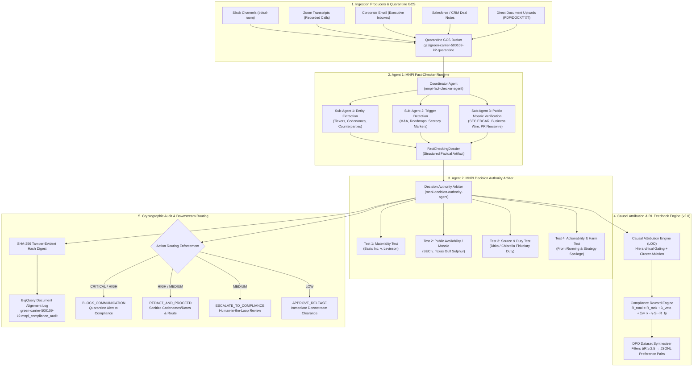
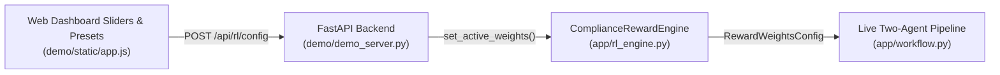

# MNPI Detection & Autonomous Compliance Pipeline
## End-to-End Architecture & Reinforcement Learning Specification (v2.0)

---

### Executive Overview

Financial institutions, asset managers, and enterprise organizations face an existential regulatory challenge when deploying generative AI systems: **the dual dilemma of autonomous compliance**.

```
                           ┌──────────────────────────────────────────────┐
                           │      THE AUTONOMOUS COMPLIANCE DILEMMA       │
                           └──────────────────────────────────────────────┘
                                                  │
                 ┌────────────────────────────────┴────────────────────────────────┐
                 ▼                                                                 ▼
      ┌──────────────────────┐                                          ┌──────────────────────┐
      │   THE LEAKY AGENT    │                                          │  THE PARANOID AGENT  │
      ├──────────────────────┤                                          ├──────────────────────┤
      │ Under-classifies     │                                          │ Over-classifies      │
      │ sensitive data.      │                                          │ public/benign data.  │
      │ Result: SEC Rule     │                                          │ Result: Destroys     │
      │ 10b-5 / 14e-3 civil  │                                          │ workflow velocity by │
      │ and criminal fines.  │                                          │ blocking Form 8-Ks.  │
      └──────────────────────┘                                          └──────────────────────┘
```

The **Material Non-Public Information (MNPI) Pipeline** resolves this dilemma. Built with the **Google Agent Development Kit (ADK)** and powered by **Gemini 3.8 Flash**, the system decouples factual verification from judicial decision-making, audits every interaction into **Google Cloud BigQuery** with SHA-256 cryptographic hashes, and aligns model behavior through a **counterfactual reinforcement learning (RL) objective** designed for zero-trading-risk training ("Trial-without-Error").

---

## 1. System Topology & End-to-End Pipeline Flow



---

## 2. Multi-Agent Protocol & The Factual Dossier

Standard single-prompt LLM classifiers suffer from hallucination and confirmation bias. The MNPI architecture enforces a strict two-agent separation of powers:

### Agent 1: `mnpi-fact-checker-agent`
* **Role**: Purely objective forensic investigation. Agent 1 is barred from issuing legal verdicts.
* **Architecture**: Orchestrates three specialized sub-agents and deterministic linguistic analyzers:
  1. `SA1_EntityExtractor`: Discovers public equity tickers, corporate entity names, transaction counterparties, and checks internal project codenames (e.g., *Project Titan*, *Project Apollo*, *Project Blue*).
  2. `SA2_TriggerDetector`: Flags market-moving event triggers across mergers & acquisitions, forward-looking earnings variances, unannounced product release slip dates, and linguistic confidentiality markers (*"strictly confidential"*, *"don't share"*, *"keep this quiet"*).
  3. `SA3_MosaicChecker`: Queries authorized top-tier press wires (SEC.gov EDGAR, Bloomberg, Reuters, Business Wire, PR Newswire) to evaluate whether the alleged event is already in the public domain.
* **Output Payload**: The `FactCheckingDossier` Pydantic model:

```python
class FactCheckingDossier(BaseModel):
    original_text: str
    entities: EntityExtractionResult
    triggers: TriggerDetectionResult
    public_check: PublicCheckResult
    dossier_summary: str
    high_risk_signals_present: bool
```

### Agent 2: `mnpi-decision-authority-agent` (The Arbiter)
* **Role**: Acts as judicial authority. Consumes the source text along with the `FactCheckingDossier` and evaluates the transmission against securities case law.
* **Tools**: Equipped with the BigQuery logging tool (`log_document_alignment_to_bq`) to generate an immutable, tamper-evident audit trail for every processed document.

---

## 3. The 4 Arbiter Assessment Criteria & Standardized Codes

Instead of unstructured rationale, the Arbiter evaluates four legally grounded criteria and assigns standardized, machine-enforceable verification codes:

| Criterion | Jurisprudence / Legal Standard | Evaluation Objective | Standardized Machine Verification Codes |
| :--- | :--- | :--- | :--- |
| **1. Materiality Test** | *Basic Inc. v. Levinson*, 485 U.S. 224 (1988) | Determines if a reasonable investor would consider the information significant in making an investment decision (Probability $\times$ Magnitude). | `MAT_01_MARKET_MOVING_MA`<br/>`MAT_02_EARNINGS_VARIANCE`<br/>`MAT_03_ROADMAP_DISRUPTION`<br/>`MAT_04_REGULATORY_RESTRICTION`<br/>`MAT_CLEARED_DE_MINIMIS` |
| **2. Public Availability Test** | Mosaic Theory & *SEC v. Texas Gulf Sulphur Co.* (1968) | Verifies whether the information has been broadly disseminated to the investing public through official channels. | `MOSAIC_01_VERIFIED_PUBLIC_WIRE`<br/>`MOSAIC_02_CONFIRMED_NON_PUBLIC`<br/>`MOSAIC_03_AMBIGUOUS_RUMOR` |
| **3. Source & Duty Test** | *Dirks v. SEC*, 463 U.S. 646 (1983); *Chiarella v. United States* (1980) | Evaluates whether information originated from a corporate insider or was communicated in breach of an NDA or fiduciary duty. | `DUTY_01_EXPLICIT_SECRECY_MARKER`<br/>`DUTY_02_INTERNAL_CODENAME`<br/>`DUTY_03_INSIDER_FIDUCIARY_BREACH`<br/>`DUTY_CLEARED_EXTERNAL_SOURCE` |
| **4. Actionability & Harm Test** | Market Microstructure & SEC Rule 10b-5 | Evaluates whether releasing this content allows front-running, predatory trading, or strategic corporate injury. | `HARM_01_FRONT_RUNNING_EXPOSURE`<br/>`HARM_02_STRATEGIC_SPOILAGE`<br/>`HARM_CLEARED_BENIGN` |

---

## 4. Reinforcement Learning ("Trial-without-Error") & Causal Attribution

Reinforcement learning on live capital markets compliance is typically impossible: an autonomous agent cannot "learn by making mistakes" when a single leak incurs catastrophic regulatory liability. 

To solve this, the pipeline introduces an offline **Counterfactual Alignment Framework (v2.0)**:

### 4.1 Multi-Objective Compliance Reward Shaping

Every decision rendered by the Arbiter is scored on a shaped multi-objective scalar reward:

$$R_{\text{total}} = R_{\text{task}} + \lambda_{\text{veto}} \cdot \mathbb{I}(\text{Veto}) + \sum_{k} w_k \cdot \text{CodePenalty}(C_k) - \gamma \cdot S_{\text{influence}} - R_{\text{fp}}$$

```
                                REWARD TERM BREAKDOWN
┌─────────────────────────┬───────────┬─────────────────────────────────────────────────────────────┐
│ Mathematical Term       │ Default   │ Functional & Regulatory Purpose                             │
├─────────────────────────┼───────────┼─────────────────────────────────────────────────────────────┤
│ R_task                  │   +1.00   │ Baseline task reward for producing legal rationale and      │
│                         │           │ structured routing directives.                              │
├─────────────────────────┼───────────┼─────────────────────────────────────────────────────────────┤
│ λ_veto · I(Veto)        │  -10.00   │ Catastrophic penalty triggered when unredacted MNPI is      │
│                         │           │ permitted to pass through without being blocked or redacted.│
├─────────────────────────┼───────────┼─────────────────────────────────────────────────────────────┤
│ R_fp                    │   -4.00   │ Anti-Conservative Bias penalty. Penalizes the model for     │
│                         │           │ hyper-conservatively blocking verified public news/8-Ks.    │
├─────────────────────────┼───────────┼─────────────────────────────────────────────────────────────┤
│ -γ · S_influence        │  γ = 2.0  │ Penalizes decisions where sensitive data causally drove the │
│                         │           │ communication. Automatically zeroes out when redacted.      │
├─────────────────────────┼───────────┼─────────────────────────────────────────────────────────────┤
│ Σ w_k · CodePenalty(C_k)│ Variable  │ Auditable credit (+1.0) for identifying and mitigating      │
│                         │           │ violations, or negative penalty (w_k) for missing them.     │
└─────────────────────────┴───────────┴─────────────────────────────────────────────────────────────┘
```

---

### 4.2 Causal Attribution Engine via Counterfactual Leave-One-Out (LOO)

Standard classifiers often trigger false alarms because of benign prompt wording or conversational context. The Causal Engine runs counterfactual interventions:

1. **Full Violation Probability**: $P(\text{Violation} \mid \text{Prompt} + \text{Candidate Tokens})$
2. **Counterfactual Probability**: $P(\text{Violation} \mid \text{Prompt} + \emptyset)$
3. **Data Influence Score**:
   $$S_{\text{influence}} = P(\text{Violation} \mid \text{Prompt} + \text{Data}) - P(\text{Violation} \mid \text{Prompt} + \emptyset)$$
4. **Prompt Context Score**:
   $$U = P(\text{Violation} \mid \text{Prompt} + \emptyset)$$
5. **Causal Dominance Test**:
   $$\text{is\_causally\_dominant} = \text{True} \iff S_{\text{influence}} > (U - \tau)$$

#### Hierarchical Gating Rule (Latency Optimization)
To eliminate redundant LLM API calls and optimize inference cost, counterfactual ablation is gated by confidence thresholds:
* **$S_{\text{full}} < 0.40$**: Document is clearly benign/public. *Ablation skipped* (~65% latency reduction).
* **$S_{\text{full}} > 0.85$**: Violation is decisively certain. *Ablation skipped* to conserve compute.
* **$0.40 \le S_{\text{full}} \le 0.85$**: *Borderline Confidence Zone*. Triggers deep counterfactual ablation.

#### Multi-Leak Causal Overdetermination
When documents contain multiple independent leaks (e.g., an unannounced acquisition codename *and* a confidential purchase price), removing any single token leaves the overall violation score high ($\Delta_i \approx 0$). 

The engine implements **Joint Cluster Ablation**:
$$S_{\text{joint}} = P(\text{Violation} \mid \text{Prompt} + \mathcal{C}) - P(\text{Violation} \mid \text{Prompt} + \emptyset)$$
When individual marginal deltas $\Delta_i$ are masked but joint ablation drops violation probability to zero, the engine flags `is_overdetermined = True` and attributes causal dominance to the sensitive cluster.

---

### 4.3 Direct Preference Optimization (DPO) Dataset Builder

To fine-tune models using Direct Preference Optimization (DPO), the engine automatically pairs winning $(y_{\text{win}})$ and losing $(y_{\text{lose}})$ Arbiter verdicts and filters them by a **minimum reward margin**:

$$\Delta R = R(y_{\text{win}}) - R(y_{\text{lose}}) \ge \varepsilon_{\text{margin}} \quad (\text{default } \varepsilon = 2.5)$$

```
                                  DPO MARGIN COMPARISON
┌───────────────────────────────────────────────┬───────────────────────────────────────────────┐
│ SCENARIO A: Confidential M&A Leak             │ SCENARIO B: Routine Public Press Release      │
├───────────────────────────────────────────────┼───────────────────────────────────────────────┤
│ Winning (y_win): BLOCK_COMMUNICATION          │ Winning (y_win): APPROVE_RELEASE              │
│ Reward: +5.00                                 │ Reward: +5.50                                 │
│                                               │                                               │
│ Losing (y_lose): APPROVE_RELEASE (Unredacted) │ Losing (y_lose): BLOCK (Paranoid False Alarm) │
│ Reward: -14.80 (Triggers λ_veto = -10.0)      │ Reward: -8.00 (Triggers R_fp = -4.0)          │
│                                               │                                               │
│ Margin: ΔR = +5.00 - (-14.80) = +19.80        │ Margin: ΔR = +5.50 - (-8.00) = +13.50         │
│ Status: ACCEPTED (ΔR ≥ 2.5)                   │ Status: ACCEPTED (ΔR ≥ 2.5)                   │
└───────────────────────────────────────────────┴───────────────────────────────────────────────┘
```

The resulting preference pairs are serialized into standard JSONL format (`tests/eval/datasets/dpo_preference_pairs.jsonl`) ready for supervised alignment training.

---

## 5. Dynamic Weight Adjustment Architecture

Weights are not hardcoded; they are fully parameterized across the stack:



### Python Configuration Schema ([`app/schemas.py`](file:///Users/bschmult/.gemini/jetski/scratch/mnpi_adk_agent/app/schemas.py))
```python
class RewardWeightsConfig(BaseModel):
    r_task: float = Field(default=1.0, description="Base task execution reward")
    lambda_veto: float = Field(default=-10.0, description="Catastrophic unredacted leak veto penalty")
    false_positive_penalty: float = Field(default=-4.0, description="Anti-conservative bias penalty")
    gamma_causal: float = Field(default=2.0, ge=0.0, description="Causal influence scaling factor")
    dpo_min_margin: float = Field(default=2.5, ge=0.0, description="DPO minimum margin threshold")
    weight_mat_ma: float = Field(default=-3.0, description="MAT_01 Market Moving M&A weight")
    ...
```

### Dynamic API Endpoints ([`demo/demo_server.py`](file:///Users/bschmult/.gemini/jetski/scratch/mnpi_adk_agent/demo/demo_server.py))
* `GET /api/rl/config`: Fetches currently active runtime weights and baseline defaults.
* `POST /api/rl/config`: Updates active weights in-memory; immediately governs subsequent live evaluations.
* `POST /api/rl/reset`: Resets weights back to theoretical baseline defaults.

---

## 6. Cryptographic Audit Logging in Google Cloud BigQuery

Compliance verification requires an immutable record. Every document processed through the pipeline is audited to BigQuery table:
`green-carrier-500109-k2.mnpi_compliance_audit.document_alignment_log`

### Audit Record Schema:
```sql
CREATE TABLE `green-carrier-500109-k2.mnpi_compliance_audit.document_alignment_log` (
  timestamp TIMESTAMP NOT NULL,
  document_name STRING NOT NULL,
  channel STRING,
  verdict STRING NOT NULL,
  risk_level STRING NOT NULL,
  recommended_action STRING NOT NULL,
  materiality_score FLOAT64,
  public_availability_score FLOAT64,
  source_duty_score FLOAT64,
  harm_score FLOAT64,
  entities_detected STRING,
  triggers_detected STRING,
  has_secrecy_markers BOOLEAN,
  audit_hash STRING NOT NULL,
  summary_justification STRING,
  redacted_preview STRING,
  latency_ms FLOAT64,
  model_used STRING
);
```

### Cryptographic Hash Construction
To guarantee tamper evidence, the SHA-256 digest binds the decision to the document content:
$$\text{AuditHash} = \text{SHA256}(\text{DocumentText} \parallel \text{Verdict} \parallel \text{Timestamp} \parallel \text{Action})$$

---

## 7. Interactive Compliance Dashboard & Visual Simulator

The single-page web application (`http://127.0.0.1:8080/`) provides an interactive command center:

```
┌─────────────────────────────────────────────────────────────────────────────────────────────┐
│  [⚙️ Ingestion & Arbitration Pipeline]   [📊 BigQuery Table Explorer]   [🧠 RL Architecture] │
├─────────────────────────────────────────────────────────────────────────────────────────────┤
│                                                                                             │
│  COLUMN 1: Ingestion Producers           COLUMN 2: Agent 1 Factual Dossier                  │
│  • Slack / Zoom / Email tabs             • Entity extraction tags (tickers, codenames)      │
│  • GCS Quarantine file picker            • M&A / Roadmap trigger pills                      │
│  • Live text input area                  • Public press verification source links           │
│                                                                                             │
│  COLUMN 3: Arbiter & RL Reward           COLUMN 4: Downstream Action & Redacted Output      │
│  • 4 Legal Criteria Progress Bars        • Final Enforced Routing Banner                    │
│  • Causal Attribution Box (S, U, LOO)    • Redacted Document Preview Box                    │
│  • RL Compliance Reward (R_total)        • Live BigQuery Audit Record Card (SHA-256 Hash)   │
│                                                                                             │
└─────────────────────────────────────────────────────────────────────────────────────────────┘
```

* **Interactive Weight Simulator**: Features 6 live range sliders and 3 one-click presets (`Balanced`, `Strict Zero-Leak`, `Anti-Conservative Bias`) with 60fps local recalculation of formula values, mathematical equation displays, and DPO margin acceptance banners.

---

## 8. Verification & Test Suite Summary

The system is rigorously verified via an automated test suite across unit, causal, and integration boundaries:

```bash
$ python3 test_suite.py
----------------------------------------------------------------------
Ran 38 tests in 203.809s

OK
```

### Test Coverage Highlights:
1. `test_ablation_causal_attribution`: Verifies counterfactual drop when sensitive codename is ablated.
2. `test_hierarchical_ablation_triggering`: Validates that obvious clears ($< 0.40$) and obvious violations ($> 0.85$) bypass LOO computation to save latency.
3. `test_multi_leak_overdetermination`: Tests cluster masking when multiple concurrent leaks exist.
4. `test_conservative_bias_false_positive_penalty`: Enforces $R_{fp} = -4.0$ when public news is blocked.
5. `test_unredacted_leak_veto_penalty`: Enforces $\lambda_{\text{veto}} = -10.0$ when leaks are approved.
6. `test_dynamically_adjustable_weights_override`: Confirms runtime parameter updates dynamically scale penalties.
7. `test_dpo_pair_generation`: Validates filtering by minimum margin $\Delta R \ge 2.5$ and JSONL serialization.
8. `test_bigquery_hash_computation`: Validates deterministic SHA-256 cryptographic hashing.

---

## 9. Codebase File Structure Reference

* [`app/agents/fact_checker.py`](file:///Users/bschmult/.gemini/jetski/scratch/mnpi_adk_agent/app/agents/fact_checker.py): Agent 1 definition, sub-agents, and tools.
* [`app/agents/arbiter.py`](file:///Users/bschmult/.gemini/jetski/scratch/mnpi_adk_agent/app/agents/arbiter.py): Agent 2 Arbiter definition and judicial prompt.
* [`app/causal_engine.py`](file:///Users/bschmult/.gemini/jetski/scratch/mnpi_adk_agent/app/causal_engine.py): Causal Attribution Engine, Hierarchical Gating, Joint Cluster Ablation.
* [`app/rl_engine.py`](file:///Users/bschmult/.gemini/jetski/scratch/mnpi_adk_agent/app/rl_engine.py): Multi-Objective Reward Engine, DPO Dataset Synthesizer, Dynamic Weight Management.
* [`app/schemas.py`](file:///Users/bschmult/.gemini/jetski/scratch/mnpi_adk_agent/app/schemas.py): Pydantic models, standardized verification codes, `RewardWeightsConfig`.
* [`app/workflow.py`](file:///Users/bschmult/.gemini/jetski/scratch/mnpi_adk_agent/app/workflow.py): Google ADK sequential workflow orchestration and fallback runners.
* [`app/audit_logger.py`](file:///Users/bschmult/.gemini/jetski/scratch/mnpi_adk_agent/app/audit_logger.py): BigQuery live insertion and SHA-256 cryptographic verification.
* [`demo/demo_server.py`](file:///Users/bschmult/.gemini/jetski/scratch/mnpi_adk_agent/demo/demo_server.py): FastAPI backend, GCS quarantine handlers, and `/api/rl/config` endpoints.
* [`demo/static/index.html`](file:///Users/bschmult/.gemini/jetski/scratch/mnpi_adk_agent/demo/static/index.html): Ingestion pipeline, BigQuery explorer, and RL architecture view.
* [`demo/static/app.js`](file:///Users/bschmult/.gemini/jetski/scratch/mnpi_adk_agent/demo/static/app.js): Client-side controller, real-time formula simulator, and slider event bindings.
* [`demo/static/style.css`](file:///Users/bschmult/.gemini/jetski/scratch/mnpi_adk_agent/demo/static/style.css): Dashboard styles, slider controls, and DPO margin banners.
